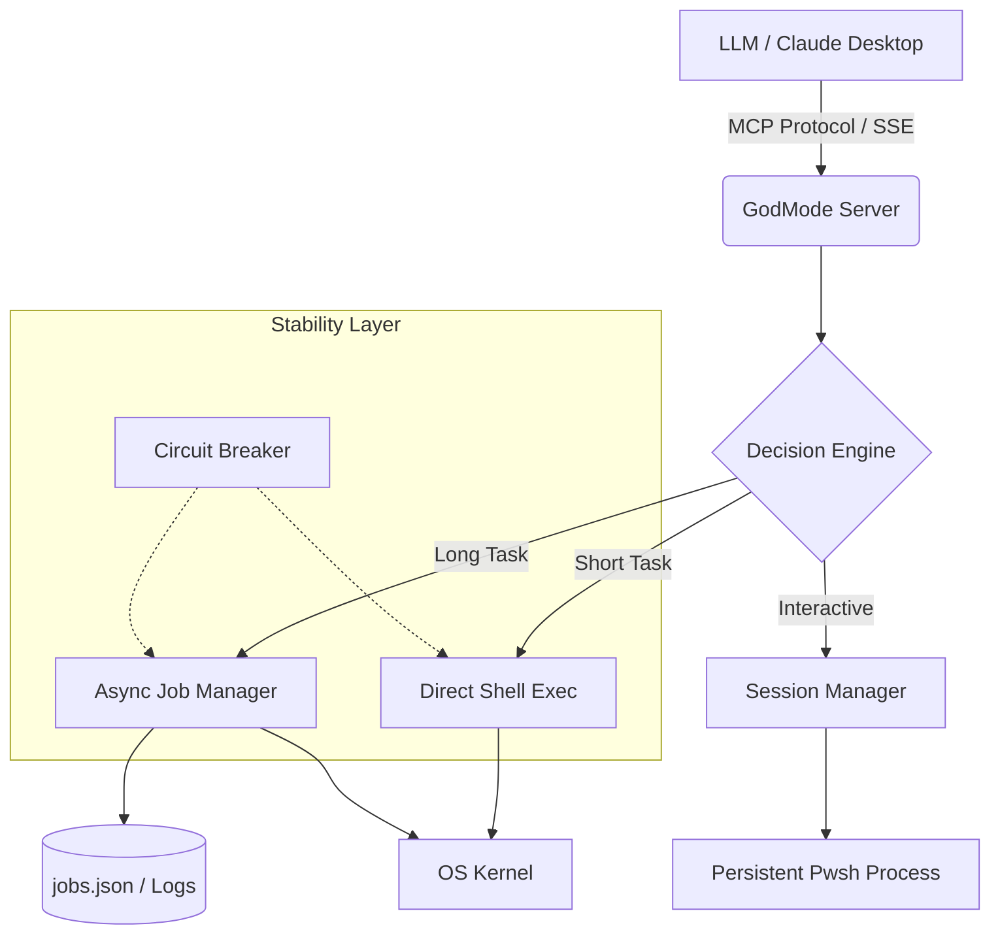

# ⚡ GodMode MCP Server
### The Omnipotent Interface for LLM System Control

<div align="center">


**Give your AI Agents direct, asynchronous, and persistent control over the operating system.**
*Shell Execution • File System Mastery • Network Introspection • Background Job Management*

[Features](#-core-capabilities) • [Architecture](#-system-architecture) • [Installation](#-deployment) • [Security](#-security-protocol)

</div>

---

## 🛑 Security Warning
> **⚠️ CRITICAL:** This server provides **Remote Code Execution (RCE)** capabilities to connected clients. It allows the LLM to execute shell commands, modify files, and control system processes.
> * **Do NOT** expose this server to the public internet.
> * **Do NOT** run this on critical production environments without sandboxing.
> * **ALWAYS** review the code before deployment.

---

## 📖 Overview

**GodMode** is a high-performance implementation of the **Model Context Protocol (MCP)**. Unlike standard sandboxed tools, GodMode bridges the gap between the LLM and the host OS kernel.

It features a custom **Async Job Manager** for long-running processes, a **Circuit Breaker** pattern for fault tolerance, and **Persistent State** management to survive server restarts. It transforms a standard LLM into a fully capable System Administrator.

## 🚀 Core Capabilities

### 1. 🐚 Advanced Shell & Process Control
* **Async Execution:** Non-blocking command execution via `shell_exec`.
* **Smart Execution:** Automatically promotes long-running commands to background jobs (`smart_exec`).
* **Job Persistence:** Detached background jobs survive server restarts. Monitor logs, stop, or query status anytime.
* **Circuit Breaker:** Automatic fault isolation—if a tool fails repeatedly, it enters a cooldown state to prevent system instability.

### 2. 💻 Interactive Sessions
* **Virtual Terminal:** Maintain stateful PowerShell/Bash sessions.
* **Context Awareness:** Set environment variables or navigate directories, and the session remembers.

### 3. 📂 File System Authority
* **Deep Search:** Grep-like recursive pattern searching (`fs_search`).
* **Smart Read:** Pagination and "tail" modes for reading massive log files without memory overflows.
* **CRUD:** Full Create, Read, Update, Delete capabilities.

### 4. 🌐 Network & System God Mode
* **Introspection:** View open sockets, routing tables, and interface stats (`net_inspect`).
* **Diagnostics:** DNS resolution and TCP port testing.
* **Resource Monitoring:** Real-time CPU, RAM, and Disk load analysis.

---

## 🏗 System Architecture

GodMode is built on `FastMCP` (Starlette/Uvicorn) with a custom threading model for process management.



---

## 🛠 Deployment

### Prerequisites

* Python 3.10+
* PowerShell (Recommended for Windows) or Bash (Linux)

### 1. Clone & Install

```bash
git clone [https://github.com/yourusername/godmode-mcp.git](https://github.com/yourusername/godmode-mcp.git)
cd godmode-mcp

# Create virtual environment
python -m venv venv
source venv/bin/activate  # or venv\Scripts\activate on Windows

# Install dependencies
pip install mcp[cli] uvicorn starlette psutil

```

### 2. Configuration

Ensure the script is named `server.py` (Not `mcp.py` to avoid import conflicts).

### 3. Running the Server

```bash
# Run on default port 8000
python server.py

```

---

## 🔌 Connecting to Clients

### Claude Desktop App

Add the following to your `%APPDATA%\Claude\claude_desktop_config.json` (Windows) or `~/Library/Application Support/Claude/claude_desktop_config.json` (Mac).

```json
{
  "mcpServers": {
    "godmode": {
      "command": "path/to/venv/Scripts/python",
      "args": ["path/to/godmode/server.py"]
    }
  }
}

```

---

## 🧰 Tool Reference

<details>
<summary><strong>⌨️ Shell & Jobs</strong> (Click to Expand)</summary>

| Tool Name | Description |
| --- | --- |
| `shell_exec` | Execute a single command. Returns stdout/stderr. |
| `smart_exec` | Runs a command. If it takes >3s, converts to a background job. |
| `job_start` | Explicitly start a detached background process. |
| `job_list` | Show all running/completed/failed jobs. |
| `job_stop` | Hard kill a background job. |
| `job_logs` | Read output from a background job (supports tailing). |

</details>

<details>
<summary><strong>🖥️ Interactive Sessions</strong> (Click to Expand)</summary>

| Tool Name | Description |
| --- | --- |
| `session_create` | Spawn a new persistent shell session. |
| `session_send` | Send command to session (maintains variables/path). |
| `session_read` | Read buffered output from the session. |
| `session_kill` | Terminate the session. |

</details>

<details>
<summary><strong>📂 File System</strong> (Click to Expand)</summary>

| Tool Name | Description |
| --- | --- |
| `fs_read` | Read file content with pagination or tail support. |
| `fs_write` | Write or append content to files. |
| `fs_search` | Recursive grep search for text patterns. |
| `fs_list` | List directory contents. |
| `fs_delete` | Delete files or directories. |

</details>

<details>
<summary><strong>🌐 Network & Admin</strong> (Click to Expand)</summary>

| Tool Name | Description |
| --- | --- |
| `net_inspect` | View Interfaces, Routes, or Active Sockets. |
| `net_connect` | Test TCP connectivity to remote hosts. |
| `sys_info` | Get hardware resource usage (CPU/RAM/Disk). |
| `service_manage` | Start, Stop, or Restart system services. |
| `registry_read` | Read Windows Registry keys (Windows Only). |

</details>

---

## 🛡️ Reliability Features

1. **Crash Recovery:** The `StateManager` saves job statuses to `jobs.json`. If the server crashes, it attempts to reconcile process states upon restart.
2. **Global Shield:** A decorator wraps every tool execution.
* Catches unhandled exceptions.
* Logs errors to `error.log`.
* **Circuit Breaker:** If a tool fails 5 times rapidly, it is disabled for 60 seconds to prevent cascading system failures.


3. **Log Rotation:** Built-in `RotatingFileHandler` ensures `server.log` never consumes too much disk space.

---

## 📜 License

MIT License. Use with responsibility.

